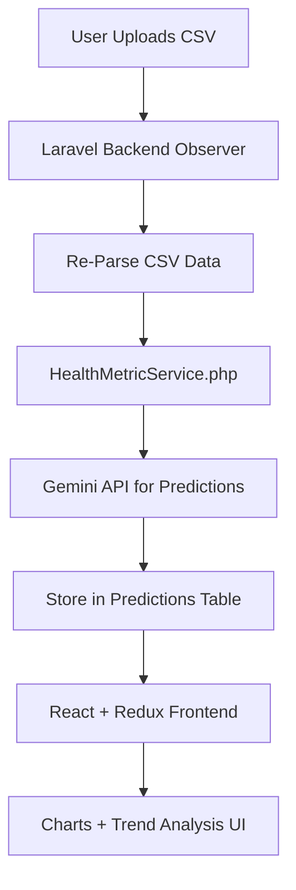

# 🏋️ Apple Watch Activity Insight Dashboard | Laravel + React + AI

A smart, interactive health analytics platform that empowers users to understand and optimize their **Apple Watch** activity data. Built with **Laravel** (OAuth2-secured backend), **React + Redux** frontend, and powered by **Gemini AI**, this tool processes massive CSV datasets to deliver actionable fitness predictions and insights.

> ✅ Developed by **Ghady Matta**, featuring real-time CSV monitoring, advanced AI forecasting, and interactive chart visualizations.

---

## 🌟 Features

| Feature              | Description                                                             |
| -------------------- | ----------------------------------------------------------------------- |
| 📂 CSV Upload        | Upload Apple Watch health data (steps, distance, active minutes) as CSV |
| 🌈 Charts & Graphs   | Daily/weekly trends visualized via charts (steps, km, minutes)          |
| 🧑‍🧠 AI Predictions | Estimate goal achievement, detect anomalies, forecast trends            |
| 🔍 Search & Filter   | Filter insights by date, metric, or activity type                       |
| 🚀 Real-Time Sync    | System re-runs AI predictions immediately when CSV is updated           |

---

## 🛠️ Tech Stack

* **Frontend**: React, Redux, Chart.js, Axios
* **Backend**: Laravel 12, Sanctum OAuth2, Events & Observers, Custom Services
* **AI**: Gemini Pro (for predictions, insights, and trend analysis)
* **Data**: CSV parsing via Laravel, tested with 100,000+ rows of historical step data

---

## 🔄 System Architecture



---

## 📆 AI-Driven Predictions

1. ✅ **Goal Achievement Estimation**

   * Will the user meet their daily/weekly activity targets?
2. ⚠️ **Anomaly Detection**

   * Identify days where behavior drastically deviates from baseline
3. 📅 **Trend Projection**

   * Predict future steps, distances, and active minutes
4. 💡 **Actionable Insights**

   * Suggest habit adjustments based on user patterns

---

## 📅 Usage Flow

1. **Login via OAuth2** (Laravel Passport)
2. **Upload or modify CSV** via UI
3. Laravel **EventListener** detects update and triggers prediction reprocessing
4. Updated predictions and charts are displayed immediately on dashboard
5. **Filter** by date, metric, or type to drill down into insights

---

## 🧪 Developer Setup

### Backend (Laravel)

```bash
cd server
composer install
cp .env.example .env
php artisan migrate
php artisan passport:install
php artisan serve
```

### Frontend (React + Redux)

```bash
cd client
npm install
npm run dev
```

---

## 📁 Folder Overview

```
applewatch-insight/
├── client/            # React + Redux frontend
│   └── src/
│       └── components/UploadCSV, Charts, Predictions
├── server/            # Laravel API backend
│   ├── app/Services/HealthMetricService.php
│   ├── app/Observers/CSVUpdateObserver.php
│   ├── app/Events/CSVUpdated.php
│   └── app/Http/Controllers/API
```

---

## 📊 Sample CSV Columns

```
Date,Steps,Distance (km),Active Minutes
2025-01-01,12493,7.52,43
2025-01-02,10930,6.89,38
...
```

---

## 📖 Next Features

* Voice command support ("How active was I last week?")
* Multi-file upload and comparison
* PDF export of health reports

---

## 👤 Author

**Ghady Matta**
Making health data meaningful with AI-powered fitness intelligence 🚀

GitHub: [@ghady-matta](https://github.com/ghady-matta)
